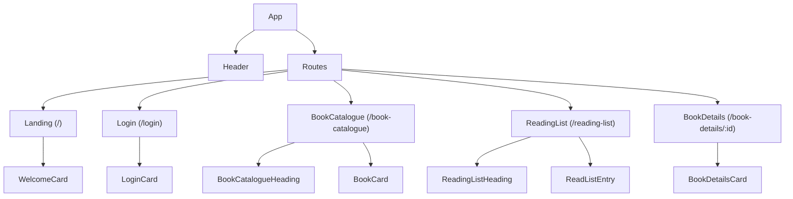

```mermaid
flowchart TD
    App --> Header
    App --> Routes

    Routes --> Landing["Landing (/)"]
    Routes --> Login["Login (/login)"]
    Routes --> BookCatalogue["BookCatalogue (/book-catalogue)"]
    Routes --> ReadingList["ReadingList (/reading-list)"]
    Routes --> BookDetails["BookDetails (/book-details/:id)"]
    
    Landing --> WelcomeCard
    Login --> LoginCard
    BookCatalogue --> BookCatalogueHeading
    BookCatalogue --> BookCard

    ReadingList --> ReadingListHeading
    ReadingList --> ReadListEntry
    BookDetails --> BookDetailsCard
``` 
