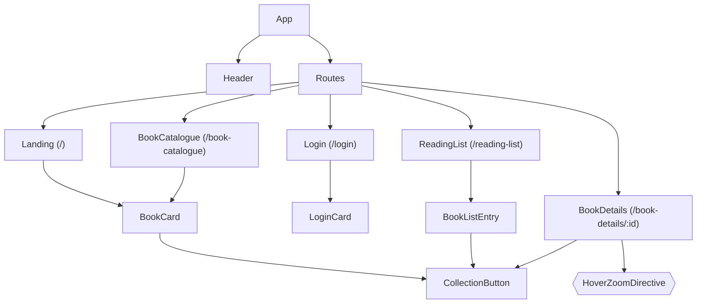

## Component tree

```mermaid
flowchart TD
    App --> Header
    App --> Routes

    Routes --> Landing["Landing (/)"]
    Routes --> Login["Login (/login)"]
    Routes --> BookCatalogue["BookCatalogue (/book-catalogue)"]
    Routes --> ReadingList["ReadingList (/reading-list)"]
    Routes --> BookDetails["BookDetails (/book-details/:id)"]

    Login --> LoginCard
    Landing --> BookCard
    BookCatalogue --> BookCard
    ReadingList --> BookListEntry

    BookCard --> CollectionButton
    BookListEntry --> CollectionButton
    BookDetails --> CollectionButton
    BookDetails --> HoverZoomDirective{{HoverZoomDirective}}
```
